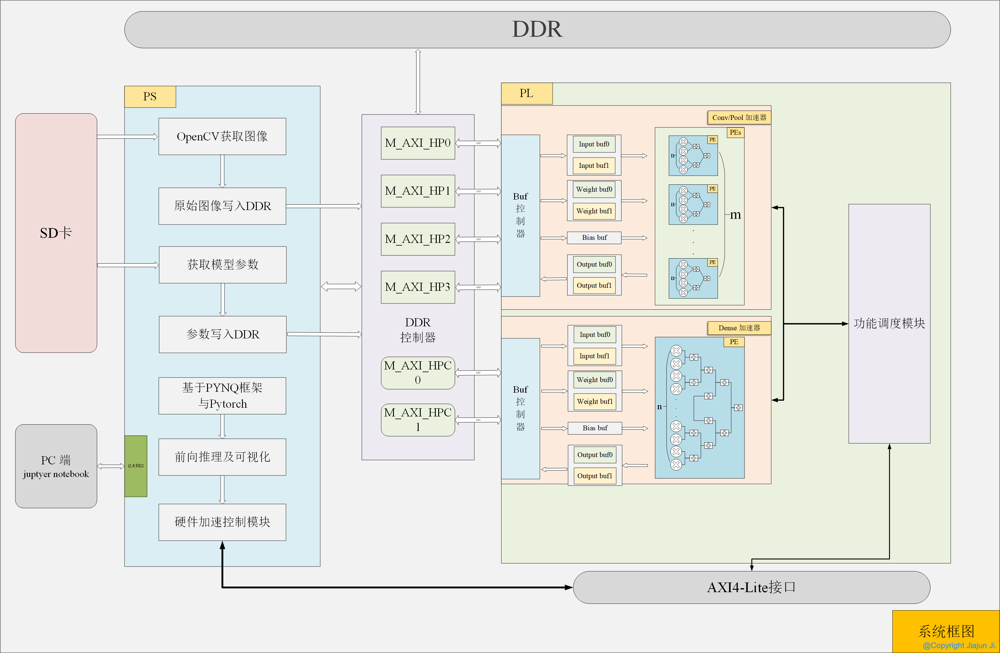
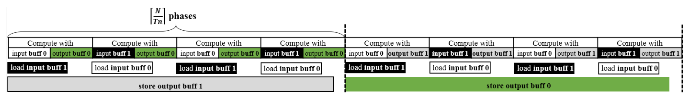
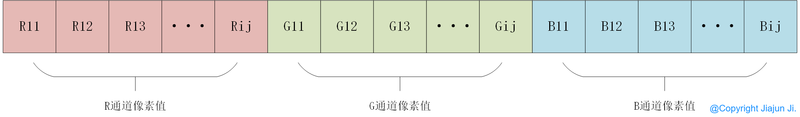
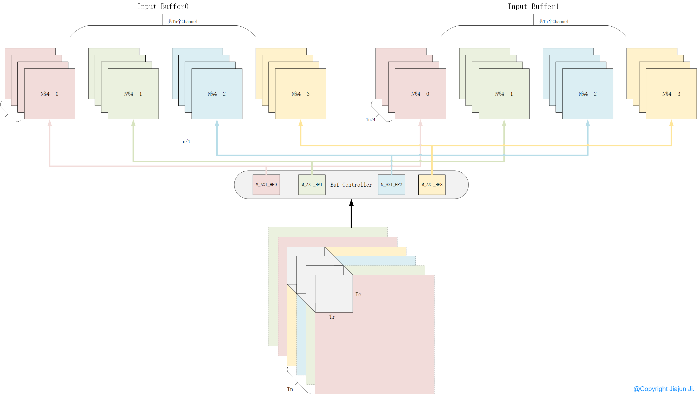
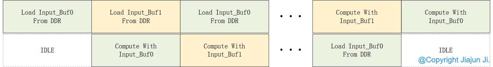
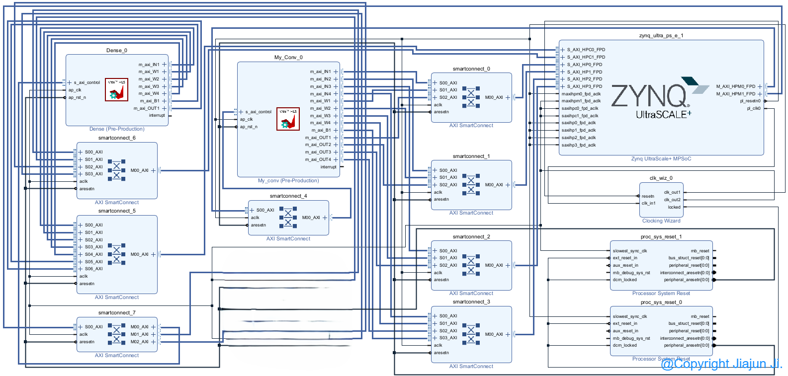

# 目录

仓库目录


[TOC]

==***待办事项***==

---

> [!NOTE]
>
> - [x] 卷积加速算子
> - [x] 池化加速算子
> - [x] 全连接加速算子
> - [x] 将各算子实现整合进一个Vivado工程实现
> - [x] FPGA全模型硬件加速跑通
> - [x] 模型量化
> - [x] 模型剪枝


# 部分可重构神经网络加速器


## 一、总体框架


### 1.1 框架图



### 1.2 部署流程


### 1.3 功能描述

1. **硬件选择：**采用Xilinx，KV260开发板，xck26-sfvc784-2LV-c芯片，Zynq Ultrascale+ MPSoC架构。

   具有117K LUT，234K FF，1248块 DSP48，144块 36Kb BRAM，64块 URAM。

2. **硬件部分**由3个IP组成：

   1. 卷积、池化加速器。
   2. 全连接Dense加速器。
   3. 图像数据格式转换加速器

3. **软件**部分采用PYNQ框架：

   1. PS侧部署PYNQ框架，采用Python运行环境。
   2. Python采用Pytorch框架，进行神经网络的软件运算。
   3. 采用标准VGG16网络。

4. **软硬件通信**采用4个AXI_HP接口以及2个AXI_HPC接口。PS侧在DDR上申请一块共享内存，供PL侧通过AXI总线访问。

   其中4个AXI_HP接口用于卷积、池化加速器，神经网络的计算量主要集中在卷积层，因此提供给卷积加速器4个HP接口并行读取DDR数据，加快其访存速度，但同样也增加了功耗。

   其中2个AXI_HPC接口用于全连接层加速器，对于全连接层，其计算量不大，但计算瓶颈在于访存。考虑到其访存集中在参数的读取上，而输入输出相比之下可忽略不计，因此使用2个HPC接口足以。

6. 卷积、全连接**层间pipeline**:

   1. 对于卷积层与全连接层完全可以使用一个IP，共用计算单元以及片上BRAM从而节省资源。但并没有采用该方案。
   2. 在资源充足的情况下，使用两个不同的IP，其分别使用私有计算单元以及BRAM，并且采用不同的HP接口，可以达到两类网络间计算互不干扰。
   3. 从而可以在运行卷积层的时候，同时进行全连接层的计算，由此可以将卷积层的计算时间与全连接层的计算时间进行互相cover，从而达到增大吞吐量的目的。
   4. 因此在可保证网络延时变化不大的情况下，增加吞吐量，即每秒可处理的前向推理次数，一帧的刷新时间即CONV/DENSE中取时间最长。

## 二、加速器硬件设计

==目前使用FP16格式，可于头文件中修改数据格式，以支持不同的量化标准==

```
typedef ap_fixed<16, 6, AP_RND, AP_SAT> data_t;
```

***卷积计算过程***



### 2.1 卷积拆分

KV260开发版，其片上BRAM有144块BRAM36Kb，共144*36Kb/1024/8 = 0.632MB片上RAM。而VGG16模型大小有500MB，想将整个模型放入片内是不可能的。因此可以将模型参数写入DDR中，我们需要设计将大型卷积拆分成n次小卷积，每次从DDR中读取小块特征图以及小块参数进行卷积运算。

**输出特征图复用**

采用输出特征图复用，对于卷积神经网络，其最大特点就是利用权值共享，减少了参数量，因此其访存量主要集中在输入输出特征图。我们采用输出特征图复用，来减少与DDR的访存，从而提升吞吐量并降低功耗。


### 2.2 输入输出特征图读取模块

#### 2.2.1 DDR数据存储格式

数据存储采用Pytorch原生推理格式，即NCHW。虽有很多自定义存储格式，可以增大突发读取长度，以增大吞吐量。但考虑到运算加速器不支持的网络层时，需要重新将数据搬移到Tensor中使用Pytorch进行前向推理。而保证数据存储格式的一致，可以避免数据重排，从而仅需使用numpy的内存复制即可，可减少数据重排时间。




#### 2.2.2 输入输出特征图分发模块

1. 使用**4个HP**接口，可在同一时刻读取**4个Channel**的数据，提高数据吞吐量。

2. 由于Padding的存在，对于输入特征图的Tr和Tc为**30**。
3. Buf_Controller通过HP接口从DDR中**突发读取**一行的数据，即16bit*30=480bit。相比于AXI随机读取，突发传输可提供更大的吞吐量。

##### HP接口读取输入特征图地址偏移

```
F_In_Off1 = (Tn_Loops_now * Tn + Tn_Tp * 4 + 0) * Hin * Win + (F_in_y_base + In_Tr_tp) * Win + F_In_x;
F_In_Off2 = (Tn_Loops_now * Tn + Tn_Tp * 4 + 1) * Hin * Win + (F_in_y_base + In_Tr_tp) * Win + F_In_x;
F_In_Off3 = (Tn_Loops_now * Tn + Tn_Tp * 4 + 2) * Hin * Win + (F_in_y_base + In_Tr_tp) * Win + F_In_x;
F_In_Off4 = (Tn_Loops_now * Tn + Tn_Tp * 4 + 3) * Hin * Win + (F_in_y_base + In_Tr_tp) * Win + F_In_x;

memcpy(line_buf1, &feature_in1[F_In_Off1], In_Tc * 2);
memcpy(line_buf2, &feature_in2[F_In_Off2], In_Tc * 2);
memcpy(line_buf3, &feature_in3[F_In_Off3], In_Tc * 2);
memcpy(line_buf4, &feature_in4[F_In_Off4], In_Tc * 2);
```



#### 2.2.3 双缓冲设计

针对Input Buf进行了双Buf设计，当Buf0正在读取的时候，Buf1用于卷积模块计算，因此可互相Cover数据读取时间，从而增大吞吐量。



### 2.3 权重读取模块

#### 2.3.1 数据存储格式

卷积核权重在DDR上排列方式如下所示。

以[Tm,Tn,Ky,Kx]的格式一维排列。由于采用4个HP接口，可同时并行读取4个Kernel，每次读取Tn\*K\*K个数据，即4\*3\*3\*16bit = 576bit。


#### 2.3.2 权重分发模块实现

##### HP接口读取输入特征图地址偏移

```
W_off1 = base_off + Tm_cnt * CHin * K * K + (0) * K * K ;
W_off2 = base_off + Tm_cnt * CHin * K * K + (1) * K * K;
W_off3 = base_off + Tm_cnt * CHin * K * K + (2) * K * K;
W_off4 = base_off + Tm_cnt * CHin * K * K + (3) * K * K;

memcpy(line_buf1, &Weight1[W_off1], 2 * K * K);
memcpy(line_buf2, &Weight2[W_off2], 2 * K * K);
memcpy(line_buf3, &Weight3[W_off3], 2 * K * K);
memcpy(line_buf4, &Weight4[W_off4], 2 * K * K);
```

在当前的设计中，选择Tn=4，与HP接口数相同，因此在读取权重的时候，使用一次突发传输即可读取Tn\*K\*K的权重数据，因此仅需Tm次传输，就可把部分卷积核读入片内Bram。


#### 2.3.3 双缓冲设计

同样，采用双Buf设计，用计算时间Cover权重读取时间，增大吞吐量。


### 2.4 卷积计算模块

#### 2.4.1 卷积计算过程

##### 卷积计算伪代码

对CHin、CHout进行完全展开，对Wout进行Factor=2的展开，即可例化共有2\*Tm\*Tn个计算单元的乘加树。

在我们的设计中，Tm=32，Tn=4，即使用2\*32\*4 = 256个DSP，可在II为1的情况下，完成256次乘加运算。

```
Ky:															-----Loop Ky
for (int ii = 0; ii < K; ii++) 
    Kx:														-----Loop Kx
    for (int jj = 0; jj < K; jj++) 
        Hout:												-----Loop Tr
        for (int i = 0; i < Tr; i++) 
            Wout:											-----Loop Tc	unroll factro=2
            for (int j = 0; j < Tc; j++) 
                CHout:										-----Loop Tm	Unroll complete
                for (int cout = 0; cout < Tm; cout++) 
                    CHin:									-----Loop Tn	Unroll complete
                    for (int cin = 0; cin < Tn; cin++) 
                    Load();
                    Compute();
                    Write Output();
```

```
for(row=0; row<R; row++){
 for(col=0; cow<C; cow++){
  for(to=0; to<M; to++){
   for(ti=0; ti<N; ti++){
    for(i=0; i<K;i++){
     for(j=0;j<K,j++){
      output_fmp[to][row][col] += weights[to][ti][i][j] * input_fm[ti][S*row+i][S*col+j];
}}}}}}
```

循环分块

```
for(row=0; row<R; row+=Tr){
 for(col=0; cow<C; cow+=Tc){
  for(to=0; to<M; to+=Tm){
   for(ti=0; ti<N; ti+=Tn){
   //load output feature maps
   //load weights
   //load input feature maps
   
   //这里是内层循环
   for(trr=row;trr<min(row+Tr,R);trr++){
    for(tcc=col;tcc<min(col+Tr,C);tcc++){
     for(too=to;too<min(to+Tm,M);too++){
      for(tii=ti;tii<min(ti+Tn,N);tii++){
       for(i=0;i<K;i++){
        for(j=0;j<K;j++){
         output_fmp[too][trr][tcc] += weights[too][tii][i][j] * input_fm[tii][S*trr+i][S*tcc+j];
        }}}}}
   //内层循环结束
   //store output feature maps
}}}}}
```

输入特征图复用

```
for(row=0; row<R; row+=Tr){
 for(col=0; cow<C; cow+=Tc){
  for(ti=0; ti<N; ti+=Tn){
   for(to=0; to<M; to+=Tm){
   //load output feature maps
   //load weights
   //load input feature maps
   
   //这里是内层循环
   for(trr=row;trr<min(row+Tr,R);trr++){
    for(tcc=col;tcc<min(col+Tr,C);tcc++){
     for(too=to;too<min(to+Tm,M);too++){
      for(tii=ti;tii<min(ti+Tn,N);tii++){
       for(i=0;i<K;i++){
        for(j=0;j<K;j++){
         output_fmp[too][trr][tcc] += weights[too][tii][i][j] * input_fm[tii][S*trr+i][S*tcc+j];
        }}}}}
   //内层循环结束
   //store output feature maps
}}}}}
```


##### 卷积计算流程图


#### 2.4.2 硬件实现

##### 计算单元

在我们的设计中，将Loop_Tm,Loop_Tn完全展开，将TC共例化了2*32 = 64个PE，而每个PE中包含一个四输入乘加树，在FP16的格式下，共使用256个DSP，每一个时钟周期可完成256次乘加运算。


##### PE结构

PE由一个四输入乘加树组成，由于片上内存空间受限，将更多地Bram用于输出特征图以提高数据复用，减少访存。因此只对Input_Buf提供了4个Channel大小。因此使用四输入乘加树，来同时对4个Input_Channel进行并行计算。


### 2.5 片上Buf存储格式

为提高卷积单元的吞吐量，采用pipeline设计，此时为保证计算模块的==II==（Initiation Interval，即计算模块的启动间隔）为1，即每次时钟都可进行一次计算。

为此，对于Input_Buf，需要一个时钟周期提供Tn\*2个数据；Weight_Buf需要提供Tm\*Tn个数据；Output_BUf需要提供Tm\*2个数据。

而对于双口Bram来说，每个时钟周期可提供2个数据，因此需要改变数据在物理上的排列方式，提高吞吐量。

#### 2.5.1 HLS 编译指令

##### Array_Partition

Partition指令会将一个数组拆分成多个Ram实现，以提高吞吐量，但同时会消耗更多地Ram。

比如使用Complete指令，会使原先一个时钟周期读一个数据，转换成N个Ram实现，从而可以一个时钟周期读取N个数据。

假设有这样一段数据


###### Complete指令


###### Cyclic指令


###### Block指令


##### Array_Reshape

对于Xilinx的FPGA，其Bram的数据位宽以及数据深度是可配置的，也就是说对于16bit\*1024的数据，我们可以通过改变数据存储格式，对其做位拼接，使其转换成32bit\*512的数据。如此可在一个时钟周期，从16bit的数据吞吐量，提高到32bit。

Reshape指令可看做Partition和Map指令的组合体，可以在不显著增大资源的情况下，提高吞吐量。其本质是将n个x比特数据，进行位拼接，合并成1个n\*x比特数据，如下所示。


###### Cyclic指令


#### 2.5.2 Input_Buf


```
static data_t input_buffer0[Tn][In_Tr][In_Tc] = {0};
static data_t input_buffer1[Tn][In_Tr][In_Tc] = {0};
    
#pragma HLS BIND_STORAGE variable=input_buffer0 type=ram_2p impl=bram
#pragma HLS BIND_STORAGE variable=input_buffer1 type=ram_2p impl=bram
#pragma HLS ARRAY_PARTITION dim=1 type=complete variable=input_buffer0
#pragma HLS ARRAY_PARTITION dim=1 type=complete variable=input_buffer1
#pragma HLS ARRAY_PARTITION dim=3 factor=2 type=cyclic variable=input_buffer0
#pragma HLS ARRAY_PARTITION dim=3 factor=2 type=cyclic variable=input_buffer1
```

#### 2.5.3 Weight_Buf

由于Weight_Buf需要在Tm和Tn维度上展开，且其总空间为Tm\*Tn\*K\*K = 1152 bit。其所需空间较少，若使用Bram进行展开则过于占用资源。

因此选择Lutram对Weight_Buf进行实现，对其在Tm，Tn方向进行ARRAY_PATITION，以提升吞吐量。

```
static data_t weight_buffer0[Tm][Tn][K][K] = {0};
static data_t weight_buffer1[Tm][Tn][K][K] = {0};
    
#pragma HLS BIND_STORAGE variable=weight_buffer0 type=ram_2p impl=lutram
#pragma HLS BIND_STORAGE variable=weight_buffer1 type=ram_2p impl=lutram
#pragma HLS ARRAY_PARTITION dim=2 type=complete variable=weight_buffer0
#pragma HLS ARRAY_PARTITION dim=2 type=complete variable=weight_buffer1
#pragma HLS ARRAY_PARTITION dim=1 type=complete variable=weight_buffer0
#pragma HLS ARRAY_PARTITION dim=1 type=complete variable=weight_buffer1
```

#### 2.5.4 Output_Buf


由于Tm=32，片上Bram主要用于output_buf中，共计32*2 = 64个，此时若对Tc维度进行Factor的展开，其Bram占用就达到了128个，且无法充分利用Bram中的空间，造成了资源浪费，因此使用Reshape编译指令，对Tc维度进行位拼接，增加位宽从而提高吞吐量，并保证对Bram空间的充分利用。

经过计算可以得到，每个Bram18k的空间占用率为28\*28\*16bit = 12.5K。

```
static data_t output_buffer0[Tm][Tr][Tc] = {0};
static data_t output_buffer1[Tm][Tr][Tc] = {0};

#pragma HLS BIND_STORAGE variable=output_buffer0 type=ram_2p impl=bram
#pragma HLS BIND_STORAGE variable=output_buffer1 type=ram_2p impl=bram
#pragma HLS ARRAY_PARTITION dim=1 type=complete variable=output_buffer0
#pragma HLS ARRAY_PARTITION dim=1 type=complete variable=output_buffer1
#pragma HLS ARRAY_RESHAPE dim=3 factor=2 type=cyclic variable=output_buffer0
#pragma HLS ARRAY_RESHAPE dim=3 factor=2 type=cyclic variable=output_buffer1
```

### 2.6 全连接计算模块

全连接层的计算本质就是向量-矩阵乘法。这里我们依然使用乘加树的形式进行计算。

经过测试，全连接层的计算瓶颈主要是权重参数的访存，对于VGG16，其Dense0的参数有102760448个，共102760448*16 = 1644167168bit = 1.64Gb。

因此主要优化在于提升权重的吞吐量。

#### 2.6.1 输入输出Buf

对于全连接层的Input数据，可看做为一个向量，其在DDR上的排序为一维数据。


##### 双缓冲设计

每次计算，可从DDR中突发读取Tn长度的数据，这里Tn取128。即128*16bit = 2048bit。

同样，采用双缓冲设计，使用数据读取时间Cover计算时间，增大吞吐量。


#### 2.6.2 权重Buf

##### 数据存储格式

对于全连接的权重数据，其在DDR上的排列如下图所示。


##### 读取模块

每回合的计算过程，从DDR读取Tm\*Tn的权重块，利用4个AXI总线，并行读取4行的数据进入片内Bram。


##### 双缓冲设计

同样采用双缓冲设计


#### 2.6.3 全连接计算模块

由于是向量矩阵乘法，其实际上仅有两层循环嵌套，因此在全连接层的计算模块中，沿In_Tile方向展开成128输入乘加树，因此可在II=1的情况下，在一个时钟周期计算出一个输出部分和数据，最终全连接模块需要128个DSP48。


## 三、模型部分


### 3.1 推理框架

采用Pytorch作为深度学习推理框架，进行模型的训练及推理工作。

### 3.2 模型选择


#### 3.2.1 Pytorch模型结构描述

```
VGG(
  (featurs): Sequential(
    (0): Conv2d(3, 64, kernel_size=(3, 3), stride=(1, 1), padding=(1, 1))
    (1): ReLU(inplace=True)
    (2): Conv2d(64, 64, kernel_size=(3, 3), stride=(1, 1), padding=(1, 1))
    (3): ReLU(inplace=True)
    (4): MaxPool2d(kernel_size=2, stride=2, padding=0, dilation=1, ceil_mode=False)
    (5): Conv2d(64, 128, kernel_size=(3, 3), stride=(1, 1), padding=(1, 1))
    (6): ReLU(inplace=True)
    (7): Conv2d(128, 128, kernel_size=(3, 3), stride=(1, 1), padding=(1, 1))
    (8): ReLU(inplace=True)
    (9): MaxPool2d(kernel_size=2, stride=2, padding=0, dilation=1, ceil_mode=False)
    (10): Conv2d(128, 256, kernel_size=(3, 3), stride=(1, 1), padding=(1, 1))
    (11): ReLU(inplace=True)
    (12): Conv2d(256, 256, kernel_size=(3, 3), stride=(1, 1), padding=(1, 1))
    (13): ReLU(inplace=True)
    (14): Conv2d(256, 256, kernel_size=(3, 3), stride=(1, 1), padding=(1, 1))
    (15): ReLU(inplace=True)
    (16): MaxPool2d(kernel_size=2, stride=2, padding=0, dilation=1, ceil_mode=False)
    (17): Conv2d(256, 512, kernel_size=(3, 3), stride=(1, 1), padding=(1, 1))
    (18): ReLU(inplace=True)
    (19): Conv2d(512, 512, kernel_size=(3, 3), stride=(1, 1), padding=(1, 1))
    (20): ReLU(inplace=True)
    (21): Conv2d(512, 512, kernel_size=(3, 3), stride=(1, 1), padding=(1, 1))
    (22): ReLU(inplace=True)
    (23): MaxPool2d(kernel_size=2, stride=2, padding=0, dilation=1, ceil_mode=False)
    (24): Conv2d(512, 512, kernel_size=(3, 3), stride=(1, 1), padding=(1, 1))
    (25): ReLU(inplace=True)
    (26): Conv2d(512, 512, kernel_size=(3, 3), stride=(1, 1), padding=(1, 1))
    (27): ReLU(inplace=True)
    (28): Conv2d(512, 512, kernel_size=(3, 3), stride=(1, 1), padding=(1, 1))
    (29): ReLU(inplace=True)
    (30): MaxPool2d(kernel_size=2, stride=2, padding=0, dilation=1, ceil_mode=False)
  )
  (classifier): Sequential(
    (0): Linear(in_features=25088, out_features=4096, bias=True)
    (1): ReLU(inplace=True)
    (2): Dropout(p=0.5, inplace=False)
    (3): Linear(in_features=4096, out_features=4096, bias=True)
    (4): ReLU(inplace=True)
    (5): Dropout(p=0.5, inplace=False)
    (6): Linear(in_features=4096, out_features=5, bias=True)
  )
)
```

### 3.3 训练部分

模型的训练使用Google Colab算力，挂载Google Drive作为文件系统。使用VGG16 ImageNet预训练模型进行训练。

数据集采用kaggle开源花朵数据集，进行花朵分类任务。

#### 3.3.1 训练结果

==后续贴表格==

### 3.4 模型量化

==目前静态量化，即参数的直接进行格式转换，因此准确度下降较大，后续进行模型量化工作，可恢复精度==

#### 3.4.1 运算资源耗费量

|    运算符    | DSP  | LUT  |
| :----------: | :--: | :--: |
|  Mul (FP32)  |  3   | 135  |
|  Mul (FP16)  |  1   | 101  |
| Adder (FP32) |  2   | 214  |
| Adder (FP16) |  -   |  47  |

#### 3.4.2 FP16量化

==待做==

#### 3.4.3 INT8量化

==待做==

### 3.5 模型剪枝

==待做==

对于VGG16密集型网络，可通过结构化剪枝的方式，降低其参数量，提高在终端设备上的推理速度，已达到实时性检测要求。

---

## 四、终端部署


### 4.1 运行环境

在KV260的嵌入式Linux系统中，搭建PYNQ运行时框架，并基于Python3.10环境，搭建Pytorch运行环境。

### 4.2 软硬件接口

---

#### 4.2.1 硬件Overlay加载

```
from pynq import Overlay
from pynq import allocate

ol=Overlay("HardWare/cnn8.bit")
ol.ip_dict
ol.download()
conv=ol.My_Conv_0
dense=ol.Dense_0
print("Overlay download finish");
```

#### 4.2.2 Conv/Pool加速器接口定义

##### PYNQ接口调用函数

```
def RunConv(conv,CHin,In_Height,In_Width,CHout,Kx,Ky,Sx,Sy,mode,relu_en,layer,feature_in,W,bias,feature_out):
    conv.write(0x10,CHin);
    conv.write(0x18,In_Height);
    conv.write(0x20,In_Width);
    conv.write(0x28,CHout);
    conv.write(0x30,Kx);
    conv.write(0x38,Ky);
    conv.write(0x40,Sx);
    conv.write(0x48,Sy);
    conv.write(0x50,mode);
    conv.write(0x58,relu_en);
    conv.write(0x60,layer);
    conv.write(0x68,feature_in.physical_address);
    conv.write(0x74,feature_in.physical_address);
    conv.write(0x80,feature_in.physical_address);
    conv.write(0x8c,feature_in.physical_address);
    conv.write(0x98,W.physical_address);
    conv.write(0xa4,W.physical_address);
    conv.write(0xb0,W.physical_address);
    conv.write(0xbc,W.physical_address);
    conv.write(0xc8,bias.physical_address);
    conv.write(0xd4,feature_out.physical_address);
    conv.write(0xe0,feature_out.physical_address);
    conv.write(0xec,feature_out.physical_address);
    conv.write(0xf8,feature_out.physical_address);
    
    conv.write(0, (conv.read(0)&0x80)|0x01 );
    tp=conv.read(0)
    while not ((tp>>1)&0x1):
        tp=conv.read(0);
```

##### IP偏移地址

```
#define XMY_CONV_CONTROL_ADDR_AP_CTRL           0x000
#define XMY_CONV_CONTROL_ADDR_GIE               0x004
#define XMY_CONV_CONTROL_ADDR_IER               0x008
#define XMY_CONV_CONTROL_ADDR_ISR               0x00c
#define XMY_CONV_CONTROL_ADDR_CHIN_DATA         0x010
#define XMY_CONV_CONTROL_BITS_CHIN_DATA         32
#define XMY_CONV_CONTROL_ADDR_HIN_DATA          0x018
#define XMY_CONV_CONTROL_BITS_HIN_DATA          32
#define XMY_CONV_CONTROL_ADDR_WIN_DATA          0x020
#define XMY_CONV_CONTROL_BITS_WIN_DATA          32
#define XMY_CONV_CONTROL_ADDR_CHOUT_DATA        0x028
#define XMY_CONV_CONTROL_BITS_CHOUT_DATA        32
#define XMY_CONV_CONTROL_ADDR_KX_DATA           0x030
#define XMY_CONV_CONTROL_BITS_KX_DATA           32
#define XMY_CONV_CONTROL_ADDR_KY_DATA           0x038
#define XMY_CONV_CONTROL_BITS_KY_DATA           32
#define XMY_CONV_CONTROL_ADDR_SX_DATA           0x040
#define XMY_CONV_CONTROL_BITS_SX_DATA           32
#define XMY_CONV_CONTROL_ADDR_SY_DATA           0x048
#define XMY_CONV_CONTROL_BITS_SY_DATA           32
#define XMY_CONV_CONTROL_ADDR_MODE_DATA         0x050
#define XMY_CONV_CONTROL_BITS_MODE_DATA         32
#define XMY_CONV_CONTROL_ADDR_RELU_EN_DATA      0x058
#define XMY_CONV_CONTROL_BITS_RELU_EN_DATA      32
#define XMY_CONV_CONTROL_ADDR_LAYER_DATA        0x060
#define XMY_CONV_CONTROL_BITS_LAYER_DATA        32
#define XMY_CONV_CONTROL_ADDR_FEATURE_IN1_DATA  0x068
#define XMY_CONV_CONTROL_BITS_FEATURE_IN1_DATA  64
#define XMY_CONV_CONTROL_ADDR_FEATURE_IN2_DATA  0x074
#define XMY_CONV_CONTROL_BITS_FEATURE_IN2_DATA  64
#define XMY_CONV_CONTROL_ADDR_FEATURE_IN3_DATA  0x080
#define XMY_CONV_CONTROL_BITS_FEATURE_IN3_DATA  64
#define XMY_CONV_CONTROL_ADDR_FEATURE_IN4_DATA  0x08c
#define XMY_CONV_CONTROL_BITS_FEATURE_IN4_DATA  64
#define XMY_CONV_CONTROL_ADDR_WEIGHT1_DATA      0x098
#define XMY_CONV_CONTROL_BITS_WEIGHT1_DATA      64
#define XMY_CONV_CONTROL_ADDR_WEIGHT2_DATA      0x0a4
#define XMY_CONV_CONTROL_BITS_WEIGHT2_DATA      64
#define XMY_CONV_CONTROL_ADDR_WEIGHT3_DATA      0x0b0
#define XMY_CONV_CONTROL_BITS_WEIGHT3_DATA      64
#define XMY_CONV_CONTROL_ADDR_WEIGHT4_DATA      0x0bc
#define XMY_CONV_CONTROL_BITS_WEIGHT4_DATA      64
#define XMY_CONV_CONTROL_ADDR_BIAS_DATA         0x0c8
#define XMY_CONV_CONTROL_BITS_BIAS_DATA         64
#define XMY_CONV_CONTROL_ADDR_FEATURE_OUT1_DATA 0x0d4
#define XMY_CONV_CONTROL_BITS_FEATURE_OUT1_DATA 64
#define XMY_CONV_CONTROL_ADDR_FEATURE_OUT2_DATA 0x0e0
#define XMY_CONV_CONTROL_BITS_FEATURE_OUT2_DATA 64
#define XMY_CONV_CONTROL_ADDR_FEATURE_OUT3_DATA 0x0ec
#define XMY_CONV_CONTROL_BITS_FEATURE_OUT3_DATA 64
#define XMY_CONV_CONTROL_ADDR_FEATURE_OUT4_DATA 0x0f8
#define XMY_CONV_CONTROL_BITS_FEATURE_OUT4_DATA 64
```


#### 4.2.3 Dense加速器接口定义

##### PYNQ接口调用函数

```
def RunDense(dense,CHin,CHout,relu_en,feature_in,W,bias,feature_out):
    dense.write(0x10,CHin);
    dense.write(0x18,CHout);
    dense.write(0x20,relu_en);
    dense.write(0x28,feature_in.physical_address);
    dense.write(0x34,W.physical_address);
    dense.write(0x40,W.physical_address);
    dense.write(0x4c,W.physical_address);
    dense.write(0x58,W.physical_address);
    dense.write(0x64,bias.physical_address);
    dense.write(0x70,feature_out.physical_address);
    
    dense.write(0, (dense.read(0)&0x80)|0x01 );
    tp=dense.read(0)
    while not ((tp>>1)&0x1):
        tp=dense.read(0);
```

##### IP偏移地址

```
#define XDENSE_CONTROL_ADDR_AP_CTRL          0x00
#define XDENSE_CONTROL_ADDR_GIE              0x04
#define XDENSE_CONTROL_ADDR_IER              0x08
#define XDENSE_CONTROL_ADDR_ISR              0x0c
#define XDENSE_CONTROL_ADDR_CHIN_DATA        0x10
#define XDENSE_CONTROL_BITS_CHIN_DATA        32
#define XDENSE_CONTROL_ADDR_CHOUT_DATA       0x18
#define XDENSE_CONTROL_BITS_CHOUT_DATA       32
#define XDENSE_CONTROL_ADDR_RELU_EN_DATA     0x20
#define XDENSE_CONTROL_BITS_RELU_EN_DATA     32
#define XDENSE_CONTROL_ADDR_FEATURE_IN_DATA  0x28
#define XDENSE_CONTROL_BITS_FEATURE_IN_DATA  64
#define XDENSE_CONTROL_ADDR_WEIGHT1_DATA     0x34
#define XDENSE_CONTROL_BITS_WEIGHT1_DATA     64
#define XDENSE_CONTROL_ADDR_WEIGHT2_DATA     0x40
#define XDENSE_CONTROL_BITS_WEIGHT2_DATA     64
#define XDENSE_CONTROL_ADDR_WEIGHT3_DATA     0x4c
#define XDENSE_CONTROL_BITS_WEIGHT3_DATA     64
#define XDENSE_CONTROL_ADDR_WEIGHT4_DATA     0x58
#define XDENSE_CONTROL_BITS_WEIGHT4_DATA     64
#define XDENSE_CONTROL_ADDR_BIAS_DATA        0x64
#define XDENSE_CONTROL_BITS_BIAS_DATA        64
#define XDENSE_CONTROL_ADDR_FEATURE_OUT_DATA 0x70
#define XDENSE_CONTROL_BITS_FEATURE_OUT_DATA 64
```


#### 4.2.4 图像预处理加速器接口定义

##### PYNQ接口调用函数

```
def RunResize(resize,Img_In,Img_Out,rows_in,cols_in,rows_out,cols_out):
    resize.write(0x10,Img_In.physical_address);
    resize.write(0x1c,Img_Out.physical_address);
    resize.write(0x28,rows_in);
    resize.write(0x30,cols_in);
    resize.write(0x38,rows_out);
    resize.write(0x40,cols_out);
    
    resize.write(0, (resize.read(0)&0x80)|0x01 );
    tp=resize.read(0)
    while not ((tp>>1)&0x1):
        tp=resize.read(0);
```

##### IP偏移地址

```
#define XRESIZE_ACCEL_CONTROL_ADDR_AP_CTRL       0x00
#define XRESIZE_ACCEL_CONTROL_ADDR_GIE           0x04
#define XRESIZE_ACCEL_CONTROL_ADDR_IER           0x08
#define XRESIZE_ACCEL_CONTROL_ADDR_ISR           0x0c
#define XRESIZE_ACCEL_CONTROL_ADDR_IMG_INP_DATA  0x10
#define XRESIZE_ACCEL_CONTROL_BITS_IMG_INP_DATA  64
#define XRESIZE_ACCEL_CONTROL_ADDR_IMG_OUT_DATA  0x1c
#define XRESIZE_ACCEL_CONTROL_BITS_IMG_OUT_DATA  64
#define XRESIZE_ACCEL_CONTROL_ADDR_ROWS_IN_DATA  0x28
#define XRESIZE_ACCEL_CONTROL_BITS_ROWS_IN_DATA  32
#define XRESIZE_ACCEL_CONTROL_ADDR_COLS_IN_DATA  0x30
#define XRESIZE_ACCEL_CONTROL_BITS_COLS_IN_DATA  32
#define XRESIZE_ACCEL_CONTROL_ADDR_ROWS_OUT_DATA 0x38
#define XRESIZE_ACCEL_CONTROL_BITS_ROWS_OUT_DATA 32
#define XRESIZE_ACCEL_CONTROL_ADDR_COLS_OUT_DATA 0x40
#define XRESIZE_ACCEL_CONTROL_BITS_COLS_OUT_DATA 32
```


### 4.3 DDR共享缓冲区定义

采用一维存储空间，可使地址连续，增大突发传输长度，可提高访存带宽。

#### 4.3.1 输入输出特征图缓冲区

```
feature_buf1=allocate(shape=(2048*64*64),cacheable=1,dtype=np.int16)
feature_buf2=allocate(shape=(2048*64*64),cacheable=1,dtype=np.int16)
```

#### 4.3.2 卷积层参数缓冲区

```
#权重
W_conv1=allocate(shape=(1024*1024*3*3),cacheable=1,dtype=np.int16)
W_conv2=allocate(shape=(1024*1024*3*3),cacheable=1,dtype=np.int16)
W_conv5=allocate(shape=(1024*1024*3*3),cacheable=1,dtype=np.int16)
W_conv7=allocate(shape=(1024*1024*3*3),cacheable=1,dtype=np.int16)
W_conv10=allocate(shape=(1024*1024*3*3),cacheable=1,dtype=np.int16)
W_conv12=allocate(shape=(1024*1024*3*3),cacheable=1,dtype=np.int16)
W_conv14=allocate(shape=(1024*1024*3*3),cacheable=1,dtype=np.int16)
W_conv17=allocate(shape=(1024*1024*3*3),cacheable=1,dtype=np.int16)
W_conv19=allocate(shape=(1024*1024*3*3),cacheable=1,dtype=np.int16)
W_conv21=allocate(shape=(1024*1024*3*3),cacheable=1,dtype=np.int16)
W_conv24=allocate(shape=(1024*1024*3*3),cacheable=1,dtype=np.int16)
W_conv26=allocate(shape=(1024*1024*3*3),cacheable=1,dtype=np.int16)
W_conv28=allocate(shape=(1024*1024*3*3),cacheable=1,dtype=np.int16)

#偏置
b_conv1=allocate(shape=(1024),cacheable=1,dtype=np.int16)
b_conv2=allocate(shape=(1024),cacheable=1,dtype=np.int16)
b_conv5=allocate(shape=(1024),cacheable=1,dtype=np.int16)
b_conv7=allocate(shape=(1024),cacheable=1,dtype=np.int16)
b_conv10=allocate(shape=(1024),cacheable=1,dtype=np.int16)
b_conv12=allocate(shape=(1024),cacheable=1,dtype=np.int16)
b_conv14=allocate(shape=(1024),cacheable=1,dtype=np.int16)
b_conv17=allocate(shape=(1024),cacheable=1,dtype=np.int16)
b_conv19=allocate(shape=(1024),cacheable=1,dtype=np.int16)
b_conv21=allocate(shape=(1024),cacheable=1,dtype=np.int16)
b_conv24=allocate(shape=(1024),cacheable=1,dtype=np.int16)
b_conv26=allocate(shape=(1024),cacheable=1,dtype=np.int16)
b_conv28=allocate(shape=(1024),cacheable=1,dtype=np.int16)
```

#### 4.3.3 全连接层参数缓冲区

```
#权重
dense0_w=allocate(shape=(25088*5000),cacheable=1,dtype=np.int16)
dense3_w=allocate(shape=(4096*4096),cacheable=1,dtype=np.int16)
dense6_w=allocate(shape=(4096*5),cacheable=1,dtype=np.int16)

#偏置
dense0_b=allocate(shape=(4096),cacheable=1,dtype=np.int16)
dense3_b=allocate(shape=(4096),cacheable=1,dtype=np.int16)
dense6_b=allocate(shape=(4096),cacheable=1,dtype=np.int16)
```

### 4.4 参数加载

使用Pytorch将模型参数取出后，存入numpy格式文件进行储存，这是由于PYNQ的allocate申请内存区时，其所申请的内存空间为numpy格式，使用numpy对参数进行操作，可减少数据拷贝时间。

```
np.save('conv1_w.npy', np.int16(model.featurs[0].weight.data*pow(2,10)))
np.save('conv2_w.npy', np.int16(model.featurs[2].weight.data*pow(2,10)))
np.save('conv5_w.npy', np.int16(model.featurs[5].weight.data*pow(2,10)))
np.save('conv7_w.npy', np.int16(model.featurs[7].weight.data*pow(2,10)))
np.save('conv10_w.npy', np.int16(model.featurs[10].weight.data*pow(2,10)))
np.save('conv12_w.npy', np.int16(model.featurs[12].weight.data*pow(2,10)))
np.save('conv14_w.npy', np.int16(model.featurs[14].weight.data*pow(2,10)))
np.save('conv17_w.npy', np.int16(model.featurs[17].weight.data*pow(2,10)))
np.save('conv19_w.npy', np.int16(model.featurs[19].weight.data*pow(2,10)))
np.save('conv21_w.npy', np.int16(model.featurs[21].weight.data*pow(2,10)))
np.save('conv24_w.npy', np.int16(model.featurs[24].weight.data*pow(2,10)))
np.save('conv26_w.npy', np.int16(model.featurs[26].weight.data*pow(2,10)))
np.save('conv28_w.npy', np.int16(model.featurs[28].weight.data*pow(2,10)))
```


## 五、性能指标

本文设计卷积神经网络加速器的VGG16前向推理时间下表所示。表中描述了VGG16的各层网络类型，以及计算量，最后给出了每一层的片上CPU计算时间以及FPGA硬件加速运算时间。VGG16网络的乘加运算量为31GOPS，加速器的推理时间为335ms，计算可得该硬件加速器在VGG16网络上的峰值性能为92.5GOPS/S。当前时钟为200M，每时钟周期可计算256次乘加运算，可以得到加速器的理论峰值性能为200M×256×2=102.4GOPS/S。该加速器在VGG16网络上的计算单元利用率达到了90.3%，具有较高的硬件利用率。根据第六节所述，本文设计加速器PL侧功耗为2.633W，因此PL侧加速器的能效比达到了35.13GOPS/W。而PS侧运行VGG16的峰值性能为5.66GOPS/S，PS侧功耗为2.237W，经过计算PS侧通过CPU计算的能效比为2.53GOPS/W。在相同的功耗下，FPGA加速器对比ARM核心达到了13.88倍的性能。 

在本文的实现中，使用ARM利用Pytorch推理时间为2711ms，使用FPGA加速时间为335.94ms，加速比达到了8.07倍，而采用剪枝后的模型，在准确率不明显下降的情况下，推理时间达到了76.64ms，加速比达到了35.38倍，可以满足端侧实时性需求。

### 5.1 标准VGG16网络

---

VGG结构虽然简单，但所含的参数量巨大，包含1.39亿个参数，其模型.pth文件达到537MB大小。而对于嵌入式设备来说，一般采用Mobilenet作为主干网络，其参数量为0.042亿。相比之下VGG16模型较大，可证明该加速器设计为通用CNN加速器，可在嵌入式终端设备中运行较大的CNN模型。

---

### 5.2 计算时间


#### 5.2.1 卷积层

---

| 类型 | 运算量FLOPs | 计算时间/ms |
| :--: | :---------: | :---------: |
| CONV |  86704128   |    14.34    |
| CONV | 1849688064  |    34.62    |
| POOL |    -----    |    15.61    |
| CONV |  924844032  |    15.65    |
| CONV | 1849688064  |    28.60    |
| POOL |    -----    |    7.52     |
| CONV |  924844032  |    13.88    |
| CONV | 1849688064  |    26.77    |
| CONV | 1849688064  |    26.79    |
| POOL |    -----    |    3.63     |
| CONV |  924844032  |    13.41    |
| CONV | 1849688064  |    26.30    |
| CONV | 1849688064  |    26.29    |
| POOL |    -----    |    1.91     |
| CONV |  462422016  |    26.24    |
| CONV |  462422016  |    26.24    |
| CONV |  462422016  |    26.24    |
| POOL |    -----    |    1.90     |
| 总计 | 15346630656 |   335.94    |

剪枝后

| 类型 | 运算量FLOPs | 计算时间/ms |
| :--: | :---------: | :---------: |
| CONV |  86704128   |    7.75     |
| CONV | 1849688064  |     11      |
| POOL |    -----    |      7      |
| CONV |  924844032  |     4.9     |
| CONV | 1849688064  |     7.3     |
| POOL |    -----    |     3.7     |
| CONV |  924844032  |     4.2     |
| CONV | 1849688064  |     4.7     |
| CONV | 1849688064  |     4.4     |
| POOL |    -----    |     2.1     |
| CONV |  924844032  |     2.3     |
| CONV | 1849688064  |     3.7     |
| CONV | 1849688064  |     3.4     |
| POOL |    -----    |     1.2     |
| CONV |  462422016  |     3.5     |
| CONV |  462422016  |     3.3     |
| CONV |  462422016  |     1.3     |
| POOL |    -----    |    0.93     |
| 总计 | 15346630656 |     76      |

---

#### 5.2.2 全连接层

---

| 类型 | 计算量FLOPs | 计算时间/ms |
| :--: | :---------: | :---------: |
|  FC  |  102760448  |   221.83    |
|  FC  |  16777216   |    30.29    |
|  FC  |   131072    |    0.37     |
| 总计 |  119668736  |   252.49    |

剪枝后

| 类型 | 计算量FLOPs | 计算时间/ms |
| :--: | :---------: | :---------: |
|  FC  |  102760448  |     0.8     |
|  FC  |  16777216   |     0.8     |
|  FC  |   131072    |     0.7     |
| 总计 |  119668736  |     2.3     |

### 5.3 实验结果


---

## 六、VIVADO实现


---

### 6.1 硬件计算加速模块资源占用

---

| 模块名称  |  LUT   |   FF   |  BRAM  |  URAM  |  DSP   |
| :-------: | :----: | :----: | :----: | :----: | :----: |
| Conv/Pool | 54702  | 41779  |   78   |   0    |  324   |
|   Dense   | 13666  | 13427  |   13   |   0    |   60   |
|  总工程   | 98406  | 103307 |   96   |   9    |  412   |
|  利用率   | 84.11% | 44.14% | 66.67% | 14.06% | 33.01% |

---

### 6.2 BLOCK DESIGN

由于资源占用过多，在200M时钟下，导致时序很难收敛。考虑到Dense层只需Cover掉Conv层的时间即可，不必追求速度。因此对Dense模块以及对应的AXI接口，提供150M时钟即可。

---




